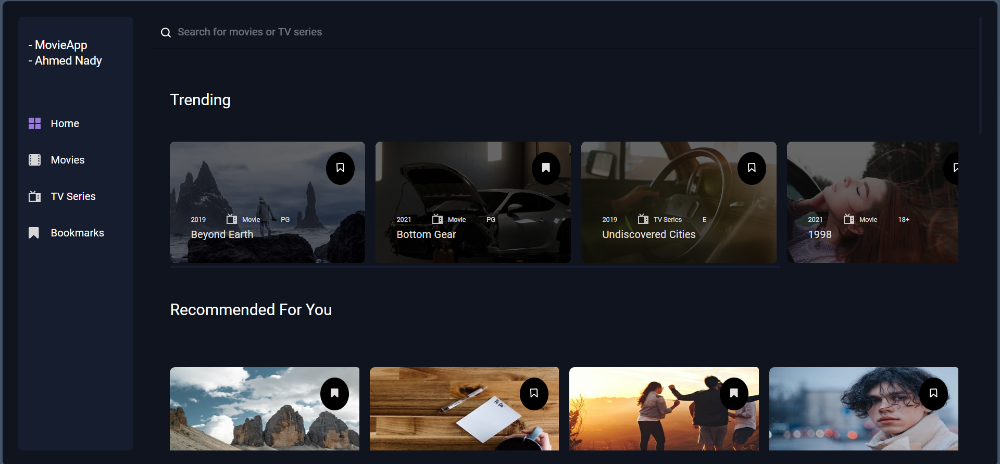

# MovieApp-using-TypeScript
try it : https://ahmed-nady-movie-app.netlify.app/
## Overview

The **MovieApp-using-TypeScript** is a React-based web app that fetches and displays trending movies and TV shows using The Movie Database (TMDb) API. The application features a modern and responsive design powered by Material-UI (MUI) and interactive elements managed with Mightymeld.

## Screenshot

 

## Features

- **Trending Movies**: Fetch and display the latest trending movies.
- **Trending TV Shows**: Fetch and display the latest trending TV shows.
- **Responsive Design**: Modern and responsive design ensuring a seamless experience on any device.
- **Interactive UI**: Utilizes Material-UI (MUI) for a polished user interface.
- **State Management**: Uses Mightymeld for effective state management and interactivity.

## Technologies Used

- TypeScript
- React
- Material-UI (MUI)
- Mightymeld
- TMDb API
- Axios (for API requests)
- CSS (for additional styling)

## Installation

To get started with the Movie Application, follow these steps:

1. **Clone the repository:**
    ```bash
    git clone https://github.com/your-username/movie-application.git
    ```

2. **Navigate to the project directory:**
    ```bash
    cd movie-application
    ```

3. **Install the required dependencies:**
    ```bash
    npm install
    ```
    or
    ```bash
    yarn install
    ```

4. **Create a `.env` file in the root directory and add your TMDb API key:**
    ```plaintext
    REACT_APP_TMDB_API_KEY=your_tmdb_api_key
    ```

5. **Start the development server:**
    ```bash
    npm start
    ```
    or
    ```bash
    yarn start
    ```

6. **Access the application by navigating to** `http://localhost:3000` **in your web browser.**

## Usage

Once the development server is running, you can explore the application by viewing trending movies and TV shows. The app provides an interactive UI with up-to-date information on popular content.

## Contributing

Contributions to the Movie Application are welcome! If you'd like to contribute, please follow these steps:

1. **Fork the repository.**
2. **Create a new branch for your feature or bug fix.**
3. **Commit your changes and push to your fork.**
4. **Open a pull request with a detailed description of your changes.**

## Contact

For any questions or feedback, please reach out to [nadyahmd88@gmail.com](mailto:nadyahmd88@gmail.com).

